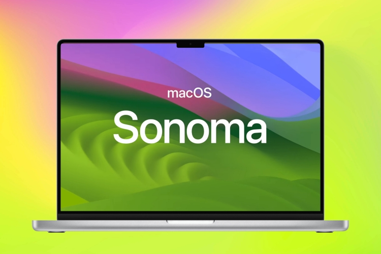

# macOS setup via Ansible

<p align="center">
  
  
</p>

        This is my personal macOS setup using Ansible and will be updating it as I go along. 
                          (Currently compatible for macOS Sonoma 14.0)

#

# Option 1: Ansible macOS setup automatic

Tested on Monterey. Requires python3. Only supports intel macs for now.

### Prerequisites

Install XCode. (The command line tools are insufficient. python3 seems to be unable to verify ssl certificates without the full app).

## How do?

### For the impatient

1. Run `init.sh`. You'll be prompted for your password.
1. Grant yourself passwordless sudo permission: `sudoers.sh -K -e nopasswd=yes`. You'll be prompted for your password.
1. Run the bootstrap script: `bootstrap.sh`.
1. Run the playbook: `setup.sh`.

### For the more patient

1. Run `init.sh`, which does the following:
    1. Accepts the Xcode license (may prompt for admin password)
    1. Installs ansible (`pip3 install --user ansible`)
    1. Installs task dependencies in `requirements.txt` (again, with `pip3 install --user`).
    1. Installs dependencies in `requirements.yml` using `ansible-galaxy`.
1. Optionally grant users the ability to use sudo with `sudoers.sh -K`. See `sudoers-playbook.yml` for
   options.
1. Run `bootstrap.sh -K` (omit `-K` if you're set up with passwordless `sudo`). This runs `bootstrap-playbook.yml`,
   which runs the Xcode first launch tasks (if necessary) and installs [MacPorts](https://www.macports.org/), along with
   several ports needed to make setup tasks work properly. You only need to do this once. The playbook is imported in
   `setup-playbook.yml`, so the tasks will run again if necessary.
1. Sign in to the app store app.
   `mas` cannot install apps unless you do so, and sign in via the command line no longer works.
   See [mas known issues](https://github.com/mas-cli/mas#%EF%B8%8F-known-issues).
1. Run `setup.sh -K` (omit `-K` if you're set up with passwordless `sudo`). The script passes all 
arguments on to `ansible-playbook`.
1. The following `tags` are defined (which you can pass to the script, e.g., `setup.sh --tags ports`):
    - **apps**:      Install applications from the app store using `mas` and from non-app-store disk images
      (see `vars/mas.yml` and `vars/dmgs.yml`).
      You must be signed in to the app store for `mas` to function properly.

    - **customize**: Customize app and OS settings.
      You need to log out and log back in to apply many of the changes.

    - **dotfiles**:  Clone my [dotfiles](https://github.com/conleym/dotfiles) and
     [emacs config](https://github.com/conleym/dot-emacs).

    - **emacs**:     Clone emacs from github, build, and install.
      Clones my [emacs config](https://github.com/conleym/dot-emacs).

    - **fonts**:     Install fonts (see `vars/fonts.yml`).

    - **launchd**:   Load launchd jobs (see `vars/launchd.yml`).

    - **pip**:       Install pip packages (see `vars/pip.yml`).

    - **ports**:     Install/update a configurable list of ports/variants
      (see `vars/ports.yml`).

    - **tex**:       Install [MacTeX](https://www.tug.org/mactex/).

### Other software installed

1. [Postman](https://www.postman.com/)
1. [iTerm2](https://www.iterm2.com/downloads.html)
1. [R](https://r-project.org/)
1. [terraform](https://www.terraform.io/)
1. [ngrok](https://ngrok.com/download)

...and more.

### Fonts installed

1. [JetBrains Mono](https://www.jetbrains.com/lp/mono/)
1. [DejaVu](https://dejavu-fonts.github.io/)


### TODO

In general, more app preferences...

### Jetbrains toolbox

1. Accept the agreement.
1. Install selected IDEs. The toolbox seems to be missing functionality to do this from the command line. Investigate
AppleScript, Automator, etc.

### VLC

Automatically enable metadata retrieval, so I don't have to click on the popup, or even see the popup.

See https://forum.videolan.org/viewtopic.php?t=126302 and
https://community.jamf.com/t5/jamf-pro/suppressing-quot-enable-metadata-retrieval-quot-prompt-in-vlc/m-p/130327

### GPG tools

GPG tools on requires some manual setup. Open Mail > Preferences > General, click on "Manage Plug-ins...",
and check the box next to the GPGMailLoader plugin.

### Other stuff

* Fonts.
    * [Noto](https://www.google.com/get/noto/)
    * [ProFont](https://tobiasjung.name/profont/)
    * [STIX](https://www.stixfonts.org/)
    * [Source Code Pro](https://github.com/adobe-fonts/source-code-pro), etc.
    * fontconfig settings for DejaVu.
* iTerm2 settings.
* More settings via `osx_defaults`.
* Secrets.
    * SSH public/private keys.
    * GPG public/private keys.
    * Log in to docker hub, jetbrains, and other accounts.

#
# Option 2: run manualy

1. Make sure you have xcode-select installed: `xcode-select --install`
2. Install Ansible:
   1. export PATH="$HOME/Library/Python/3.9/bin:/opt/homebrew/bin:$PATH"
   2. sudo pip3 install ansible --upgrade pip
   3. pip3 install ansible
3. Clone this repo
4. Run `ansible-playbook main.yml -r requirements.yml` inside this directory. Enter your account password when prompted (for sudo access).
5. Run `ansible-playbook main.yml --ask-become-pass` inside this directory. Enter your macOS account password when prompted for the 'BECOME' password.
#

# Option 3: run xcode :
### Xcode 
```sh
xcode-select --install
xcodebuild -license accept
softwareupdate --install-rosetta
```

### Ansible
```
sudo python3 -m pip install --upgrade pip
sudo python3 -m pip install ansible
```

###Pre-requisites
 - Set machine
 - Github access token

### Install
```
ansible-playbook main.yaml --ask-become-pass
```

### Post install
- Set password on ssh key

### TODO
- more zshrc stuff
- iterm colors
- zsh theme
- zprofile

# ROLES

| Role   |      Price      |
|----------|:-------------:|
| left-aligned | $16 |
| centered   |   $12 |
| right-aligned |    $1 |
| default       | $16 |        
| dotfiles       | $16 |      
| emacs       | $16 |          
| gnu_parallel  | $16 |      
| homebrew  | $16 |      
| install_from_dmg  | $16 |      
| iterm2  | $16 |      
| iterm2_shell_integration  | $16 |      
| launchd_load  | $16 |      
| launchd_unload  | $16 |      
| macos_version  | $16 |      
| macports  | $16 |      
| mactex  | $16 |      
| mount_dmg  | $16 |      
| ngrok  | $16 |      
| node  | $16 |      
| oh-my-zsh  | $16 |      
| postman  | $16 |      
| r_app  | $16 |      
| settings  | $11 |      
| ssh-key  | $11ff |      
| steamcmd  | $11as |      
| terraform  | $11as |      
| unmount_dmg  | $16 |      
| vscode-extensions  | $16 |      
| xact  | $16 |      
| xcode_firstlaunch  | $16 |      